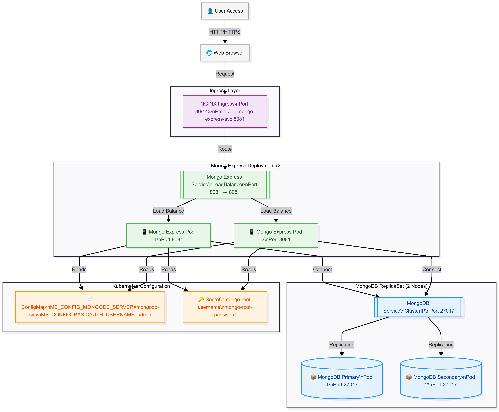

# Kubernetes MongoDB Express Application


A production-ready Kubernetes deployment of MongoDB with Mongo Express web interface, featuring secure configuration management, resource allocation, and ingress routing.

## 🖼️ Application Preview


*MongoDB Express web interface running on Kubernetes*

## 🏗️ Architecture Overview


*Architecture diagram showing the Kubernetes deployment of MongoDB and Mongo Express*

### Component Details

- **MongoDB**: Runs in 2 pods for high availability, exposed via ClusterIP service on port 27017
- **Mongo Express**: Web interface running in 2 pods, exposed via LoadBalancer service on port 8081 (NodePort: 32000)
- **Configuration**: Managed using Kubernetes Secrets and ConfigMaps
- **Ingress**: NGINX Ingress Controller routes traffic to Mongo Express

### 🚀 Why This Deployment Matters in Production

In enterprise environments, database management requires robust, scalable, and secure solutions. This Kubernetes deployment addresses critical production needs:

| Feature | Benefit |
|---------|---------|
| **High Availability** | 🛡️ Multi-replica deployments ensure zero-downtime database operations |
| **Resource Isolation** | 🏗️ Dedicated namespace and resource limits prevent resource contention |
| **Security** | 🔒 Encrypted secrets and network isolation protect sensitive data |
| **Controlled Access** | 🛂 GUI-based interaction prevents unauthorized database operations |
| **Access Layer** | 🌉 Web interface acts as a secure gateway to MongoDB |
| **Scalability** | 📈 Horizontal pod autoscaling for varying workloads |
| **Observability** | 📊 Centralized logging and monitoring |
| **DevOps Ready** | 🔄 Infrastructure-as-code for CI/CD pipelines |

> 💡 **Note**: This table highlights the key production benefits of this deployment

## 🏗️ Deployment Architecture Components

```mermaid
graph TD
    %% Styling
    classDef mongo fill:#e3f2fd,stroke:#2196f3,color:#0d47a1,stroke-width:2px
    classDef express fill:#e8f5e9,stroke:#4caf50,color:#1b5e20,stroke-width:2px
    classDef k8s fill:#fff3e0,stroke:#ff9800,color:#e65100,stroke-width:2px
    classDef ingress fill:#f3e5f5,stroke:#9c27b0,color:#6a1b9a,stroke-width:2px
    classDef resource fill:#e0f7fa,stroke:#00bcd4,color:#006064,stroke-width:2px
    
    %% Nodes
    mdb1[(📊 MongoDB\nDatabase)]
    mdb2[(📊 MongoDB\nReplica)]
    mdbSvc[MongoDB Service\nPort 27017]
    
    me[🌐 Mongo Express\nWeb Interface]
    meSvc[Mongo Express Service\nPort 8081]
    
    k8s[⚙️ Kubernetes\nManifests]
    res[📈 Resource\nManagement]
    
    nginx[🌉 NGINX Ingress\nPort 80/443]
    user[👤 User Access]
    
    %% Connections
    mdb1 --> mdbSvc
    mdb2 --> mdbSvc
    me --> mdbSvc
    meSvc --> me
    nginx --> meSvc
    user --> nginx
    
    %% Apply styles
    class mdb1,mdb2,mdbSvc mongo
    class me,meSvc express
    class k8s k8s
    class nginx ingress
    class res resource
    
    %% Legend
    click mdb1 "#mongodb" _self
    click me "#mongo-express" _self
    click nginx "#ingress" _self
```



### Deployment Component Details

- **📊 MongoDB Database**: High-availability NoSQL database with persistent storage and automatic failover
- **🌐 Mongo Express**: Modern web interface for MongoDB administration with role-based access control
- **⚙️ Kubernetes Resources**: Production-grade manifests following security best practices
- **🌉 NGINX Ingress**: Secure external access with SSL termination and path-based routing
- **📈 Resource Management**: Optimized CPU and memory allocation with auto-scaling capabilities

## 📋 Prerequisites

- Kubernetes cluster (v1.20+)
- kubectl configured and connected to your cluster
- NGINX Ingress Controller installed
- Docker runtime environment

## 🚀 Quick Start

### 1. Clone the Repository

```bash
git clone <repository-url>
cd k8s-mongo-express-app
```

### 2. Deploy to Kubernetes

```bash
# Apply all manifests in order
kubectl apply -f manifests/

# Or apply individually
kubectl apply -f manifests/01-namespace.yaml
kubectl apply -f manifests/02-secret.yaml
kubectl apply -f manifests/03-configmap.yaml
kubectl apply -f manifests/04-mongodb.yaml
kubectl apply -f manifests/05-mongo-express.yaml
kubectl apply -f manifests/06-ingress.yaml
```

### 3. Verify Deployment

```bash
# Check all resources in mongo-db namespace
kubectl get all -n mongo-db

# Check pod status
kubectl get pods -n mongo-db

# Check services
kubectl get svc -n mongo-db
```

### 4. Access the Application

```bash
# Add to /etc/hosts (Linux/macOS) or C:\Windows\System32\drivers\etc\hosts (Windows)
echo "127.0.0.1 mongodb.local" >> /etc/hosts

# Access via browser
http://mongodb.local
```

## 📁 Project Structure

```text
📦 k8s-mongo-express-app
├── 📂 manifests/               # Kubernetes configuration files
│   ├── 01-namespace.yaml      # 🔒 Kubernetes namespace
│   ├── 02-secret.yaml         # 🔑 MongoDB credentials
│   ├── 03-configmap.yaml      # ⚙️  Application configuration
│   ├── 04-mongodb.yaml        # 🍃 MongoDB deployment & service
│   ├── 05-mongo-express.yaml  # 🌐 Mongo Express deployment & service
│   └── 06-ingress.yaml        # 🌍 Ingress routing configuration
├── 📂 assets/                 # 🖼️  Documentation assets
├── 📄 README.md               # 📖 Project documentation
└── 📄 LICENSE                 # ⚖️  License file
```

## 🔧 Configuration Details

### 📊 Resource Allocation

| Component      | CPU Request | Memory Request | CPU Limit | Memory Limit |
|----------------|-------------|----------------|-----------|--------------|
| **MongoDB**    | `250m`      | `256Mi`        | `500m`    | `512Mi`      |
| **Mongo Express** | `100m`   | `128Mi`        | `200m`    | `256Mi`      |

### 🔐 Default Credentials

| Service         | Username | Password |
|-----------------|----------|----------|
| **MongoDB**     | `root`   | `passwd` |
| **Mongo Express** | `admin` | `pass`   |

> ⚠️ **Security Notice**: Change default credentials before production deployment

### Network Configuration

- **MongoDB Service**: ClusterIP on port 27017
- **Mongo Express Service**: LoadBalancer on port 8081 (NodePort: 32000)
- **Ingress**: HTTP access via `mongodb.local`

## 🛠️ Customization

### Scaling Replicas

```bash
# Scale MongoDB
kubectl scale deployment mongodb-deploy -n mongo-db --replicas=3

# Scale Mongo Express
kubectl scale deployment mongo-express-deploy -n mongo-db --replicas=3
```

### Updating Credentials

```bash
# Create new secret with custom credentials
kubectl create secret generic mongo-secret \
  --from-literal=mongo-root-username=<your-username> \
  --from-literal=mongo-root-password=<your-password> \
  -n mongo-db --dry-run=client -o yaml | kubectl apply -f -
```

### Resource Adjustment

Edit the `resources` section in deployment manifests:

```yaml
resources:
  requests:
    memory: "512Mi"
    cpu: "500m"
  limits:
    memory: "1Gi"
    cpu: "1000m"
```

## 🔍 Monitoring & Troubleshooting

### Check Pod Logs

```bash
# MongoDB logs
kubectl logs -f deployment/mongodb-deploy -n mongo-db

# Mongo Express logs
kubectl logs -f deployment/mongo-express-deploy -n mongo-db
```

### Debug Connection Issues

```bash
# Test MongoDB connectivity
kubectl exec -it deployment/mongodb-deploy -n mongo-db -- mongo --eval "db.adminCommand('ismaster')"

# Check service endpoints
kubectl get endpoints -n mongo-db
```

### Common Issues

1. **Pods not starting**: Check resource availability and image pull status
2. **Connection refused**: Verify service names and port configurations
3. **Ingress not working**: Ensure NGINX Ingress Controller is installed

## 🔒 Security Best Practices

- ✅ Secrets stored in Kubernetes Secret objects
- ✅ Base64 encoded sensitive data
- ✅ Namespace isolation
- ✅ Resource limits configured
- ✅ Non-root container execution
- ⚠️ Default credentials (change for production)
- ⚠️ HTTP ingress (consider HTTPS for production)

## 📈 Production Considerations

### High Availability

- Deploy across multiple nodes
- Use persistent volumes for MongoDB data
- Implement backup strategies
- Configure health checks

### Security Hardening

- Enable TLS/SSL encryption
- Use custom certificates
- Implement network policies
- Regular security updates

### Performance Optimization

- Adjust resource limits based on workload
- Configure MongoDB replica sets
- Implement caching strategies
- Monitor resource usage

## 🤝 Contributing

1. Fork the repository
2. Create a feature branch (`git checkout -b feature/amazing-feature`)
3. Commit your changes (`git commit -m 'Add amazing feature'`)
4. Push to the branch (`git push origin feature/amazing-feature`)
5. Open a Pull Request

## 📄 License

This project is licensed under the MIT License - see the [LICENSE](LICENSE) file for details.

## 🙏 Acknowledgments

- MongoDB team for the excellent database
- Mongo Express contributors for the web interface
- Kubernetes community for the orchestration platform
- NGINX team for the ingress controller

---

## Built with ❤️ for the Kubernetes community
